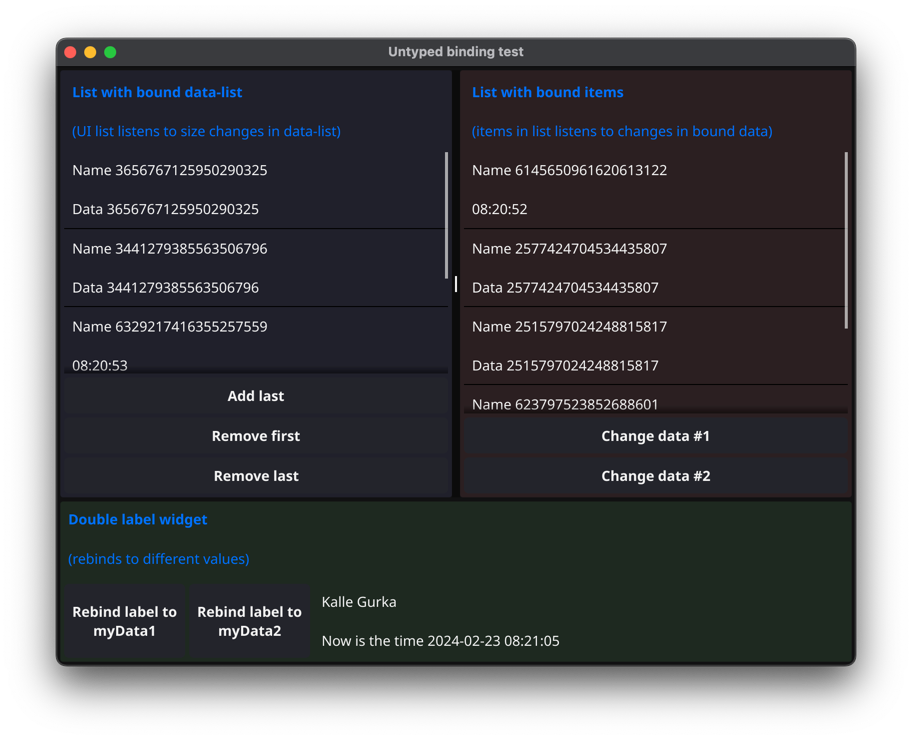

= Fyne bind external tests

This is an example application to test the "external bind" functionality of the Golang UI library Fyne.
If you would like to see examples of bound external data then I hope this example application can be of use.

The application tests different types of bindings using data in the (vertical) list widget.

.Fyne bind test application

The application tests bound data on the self-created widget "DoubleLabel" that can take external bound data. (DoubleLabel is a simple widget that is just two Labels on top of each other.)

Types of external bindings explored:

* Untyped binding of data in the entries of a Fyne (UI widget) list
* Untyped binding of list in Fyne (UI widget) list
* Untyped bind (and rebind) of UI widget

.Untyped binding of data in the entries of Fyne list
[source,go]
----
var boundDataList []binding.ExternalUntyped

for i := 0; i < 5; i++ {
    myData := createMyData(rand.Int())
    boundDataList = append(boundDataList, binding.BindUntyped(&myData))
}

list := widget.NewList(
    func() int {
        return len(boundDataList)
    },
    func() fyne.CanvasObject {
        return widget2.NewDoubleLabelWithData(nil, DoubleLabelMyDataContentExtractorFn)
    },
    func(id widget.ListItemID, object fyne.CanvasObject) {
        boundData := boundDataList[id]
        object.(*widget2.DoubleLabel).Bind(boundData)
    },
)
----

.Untyped binding of list
[source,go]
----
interfaceDataList := make([]interface{}, len(myDataList))
for i, myData := range myDataList {
    interfaceDataList[i] = myData
}

untypedList := binding.BindUntypedList(&interfaceDataList)

list := widget.NewListWithData(
    untypedList,

    func() fyne.CanvasObject {
        return widget2.NewDoubleLabelWithData(nil, DoubleLabelMyDataContentExtractorFn)
    },

    func(item binding.DataItem, object fyne.CanvasObject) {
        untyped := item.(binding.Untyped)
        myDataInterface, _ := untyped.Get()
        myData := myDataInterface.(model.MyData)

        untypedMyData := binding.BindUntyped(&myData)

        doubleLabel := object.(*widget2.DoubleLabel)
        doubleLabel.Bind(untypedMyData)
    },
)
----

.Untyped bind (and rebind) of UI widget
[source,go]
----
boundMyData1 := binding.BindUntyped(myData1)
boundMyData2 := binding.BindUntyped(myData2)

rebind1LabelButton := widget.NewButton("Rebind label to\nmy data 1", func() { doubleLabel.Bind(boundMyData1) })
rebind2LabelButton := widget.NewButton("Rebind label to\nmy data 2", func() { doubleLabel.Bind(boundMyData2) })
----

== What is "bind" and "binding" in Fyne

Well, If you write a UI application a tad more advanced than "Hello World", you will most likely come to the point where you want to change a value (in your application data-model) using the UI. The change of the value will then be reflected in several places in the UI that need to be updated.

Sure, you can hard-wire your application to update all those places for every point where you can edit or change your data-model. +
Or you can have a single function that takes care of all the UI updating, but that will still be quite complex as your application grows and more edit functionality is added.

Wouldn't it be amazing if you just could update your data-model and all UI components using that particular data just updated themselves automagically? +
Well, that's what bind data does for you.

Note:: Data binding can also be used without UI components to more generically notify/send events to other parts of your program when the value changes.

Fyne has a lot of built-in bindings for simple data types such as strings, ints, bools etc.

See more in https://docs.fyne.io/binding/[Fyne data binding].

For an example of a bound value that has its value changed and by that automagically updates the UI, have a look at https://docs.fyne.io/binding/simple[Fyne UI data binding].

== What is "bind external" in Fyne

As said above, Fyne has a lot of built-in bindings for simple data types such as strings, ints, bools etc.
And they work nicely out of the box. But sometimes you would like to have larger data structures as data-model for your application, not just a heap of ints or strings.
You would also like your application UI to respond to changes in your application data-model in multiple places.

*"Bind external" is a more generic kind of bind where you can store your own struct as a bound value.*

This allows more business like data structures for your application data-model to be used as data-models for widgets and UI-components.

You wrap your own data struct value inside an external bind value and set that bind-value to all your UI-components/widgets. The UI-components/widgets are notified, by the bind-value, of changes to the wrapped data, so they can update/refresh themselves.

=== Example

You have a my-friends application with a list of selectable names to the left and an "edit details panel" to the right. You can save and load the list of friends and their details. You can also select a friend in the list and edit the details of that friend such as their names and their age.

NOTE:: This test application is actually available at https://github.com/chran554/myfriends[Github myfriends].

[source,go]
----
type Friend struct {
  FirstName   string
  FamilyName  string
  Age         int
  // etc...
}
----

Most likely, you would like to keep a list of `Friend` structs as your global data model in the program. At least, you don't want to load the data and then store all the names and details in labels and textfields. That would probably be a mayhem when you decide to save your data, and you need to extract all that information.

If your data-model for the application is a list of external binds of `Friend` struct any changes to that bound `Friend` value in the details panel would be able to update the value in the application data-model as well as automagically update any UI component/widget that has that bound `Friend` value as it's internal data-model.

